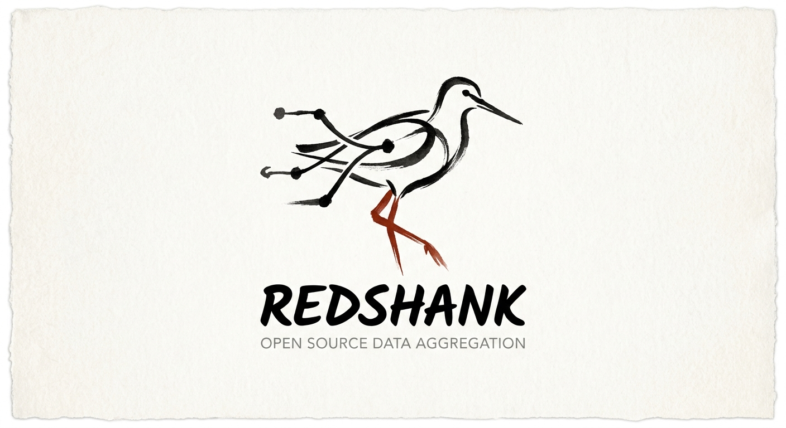

# Redshank

Redshank is an autonomous recursive language-model investigation agent written in Rust. It ingests heterogeneous public datasets — campaign finance, lobbying disclosures, federal contracts, corporate registries, sanctions lists, court records, individual-person OSINT, and media intelligence — resolves entities across all of them, and surfaces non-obvious connections through evidence-backed analysis written into a live knowledge-graph wiki.

Redshank is a from-scratch Rust rewrite of [OpenPlanter](https://github.com/ShinMegamiBoson/OpenPlanter), replacing the Python runtime with a compiled binary that has zero Python or Node.js dependency.

## Key capabilities

- **90+ fetcher modules** across government, corporate, sanctions, courts, and OSINT sources
- **Recursive agent engine** with subtask delegation and context condensation
- **Knowledge-graph wiki** with petgraph DAG and fuzzy entity resolution
- **Interactive ratatui TUI** — session sidebar, chat log, and wiki-graph canvas
- **Multi-provider LLM support** — Anthropic, OpenAI, OpenRouter, Cerebras, Ollama
- **Security-first architecture** — fail-secure RBAC, typed `AuthContext`, `chmod 600` credential storage
- **Single compiled binary** — no Python, Node.js, or runtime dependencies

## Where to start

- [Installation](./getting-started/installation.md) — build from source or install with `cargo install redshank-cli --locked`
- [Quickstart](./getting-started/quickstart.md) — run your first investigation in five minutes
- [CLI Reference](./usage/cli.md) — full command reference
- [Architecture Overview](./architecture/overview.md) — hexagonal DDD, CQRS, security model
